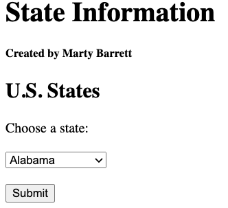
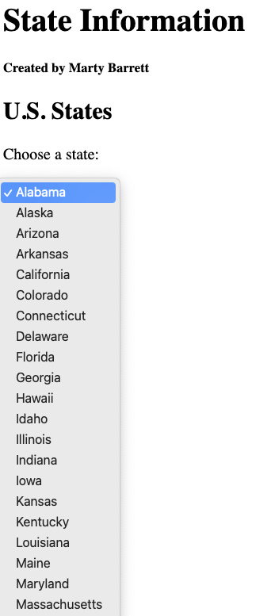
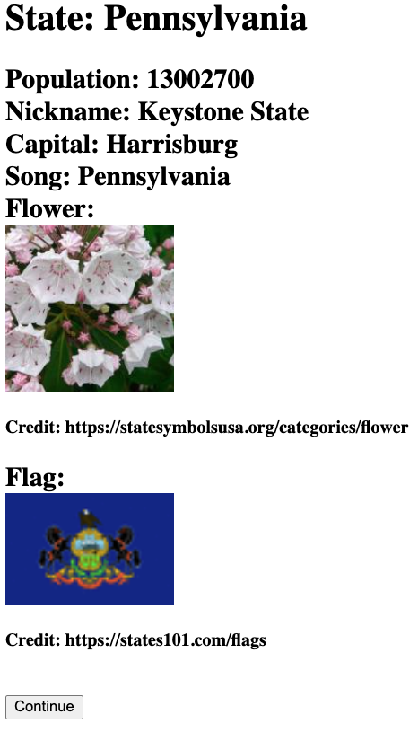
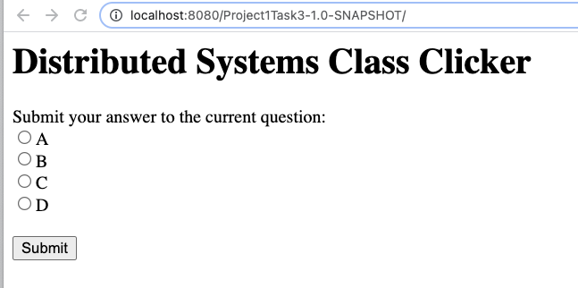
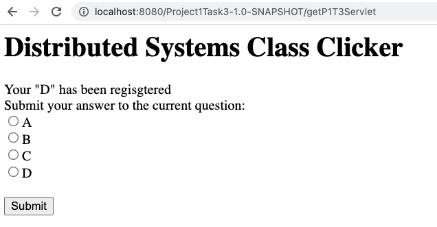
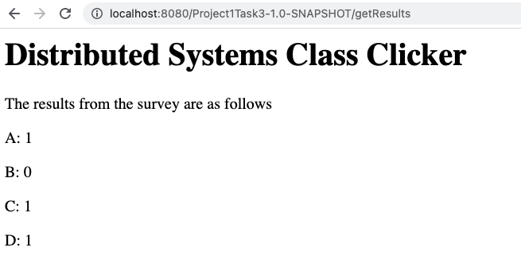
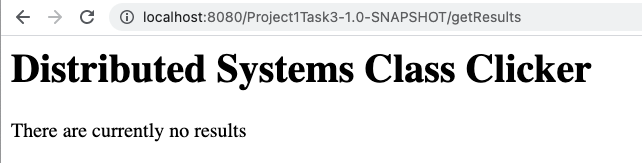

# 95-702 Distributed Systems
# Project 1
## Assigned: Friday, September 9, 2022
## Due: Friday, September 23, 2022, 11:59 PM

This project has five objectives:

**First**, you are introduced to IntelliJ and TomEE. You already have some practice with these. In this assignment, you'll build several web apps to gain more experience.

**Second**, you build your first set of distributed systems. These are two small web applications using Servlets and Java Server Pages.

**Third**, you are introduced to web scraping and API processing.

**Fourth**, you are introduced to the MVC pattern if you have not used it before.

And **fifth**, as in all projects this semester, you should reflect on the functional and non-functional characteristics (e.g. security, scalability, failure handling, interoperability) of your solutions. There will be questions on the final exam concerning these characteristics. You should be able to demonstrate a nuanced comprehension of course content and be able to explain the technical aspects in relation to potential real-world applications. For each project task, software documentation is required. The software that you
write (Java files and so on) must contain comments that describe what each significant piece of code is intended to accomplish. Points will be deducted if code is not well documented. Read the documentation-related links provided on the course schedule (for class #1) to understand what is expected. Be sure to consult the rubric for details on grading.

# Deliverables
There are two parts to deliver, all zipped into one file for upload:
- one PDF containing relevant screenshots of all the parts followed by code snippets (which is relative: how much to include is up to you for each part) that produced the result shown in the screenshot. Each section of the PDF must be clearly labeled.
- your projects, each zipped, with all of the three tasks zipped together. See the last section below for zip instructions. Note that any delivery/format problems will result in lost marks.

See the end for more detail, but read the project task descriptions first so that you know what the details are talking about.

# Task 1
# Use the IntelliJ Project Name:  Project1Task1

Create an index.jsp page that asks the user to enter a string of text data, and to make a choice of two hash functions using radio buttons. The hash function choices should be MD5 and SHA-256, with MD5 being the default.  When the submit button is pressed a request is sent to a servlet. The servlet must be named ComputeHashes.java. The servlet will compute the requested cryptographic hash value (MD5 or SHA-256) from the text transmitted by the browser. You will need to employ the Java crypto API to compute the hash of the text. The original text will be echoed back to the browser along with the name of the hash, and the hash value. The hash values sent back to the browser should be displayed in two forms: as hexadecimal text and as base 64 notation. We will discuss the use of such hash values later in the course.  To compute the MD5 and SHA-256 hashes, use these standard java packages:

    import java.security.MessageDigest;
    import java.security.NoSuchAlgorithmException;

To print the Base64 encoding, use the following method:

    javax.xml.bind.DatatypeConverter.printBase64Binary

To print the hexadecimal encoding, use the following method:

    javax.xml.bind.DatatypeConverter.printHexBinary

Be sure to provide a simple and user friendly interface.  If you are unfamiliar with HTML forms, a simple explanation can be found at:

    http://www.w3schools.com/html/html_forms.asp .

Be sure to create screen shots of your working application and submit them as described in the Submission section at the end of this document.

# Task 2
## Use IntelliJ Project Name: Project1Task2

Task 2 is meant to give you practice with several things: servlet programming, web scraping, API's and MVC. The application displays information about U.S. states: the state's population, the state's nickname, the state capital, the state song, an image of the state flower, and an image of the state flag.

Your program will present a welcome screen containing a title, your name, and a drop-down menu of the states of the United States, as in Figure 1 and Figure 2 (only some of the drop-down menu is shown). The Submit button is used to record the user's choice. Note that you will need to learn about HTML drop-down menus on your own (for example, see the W3Schools link below).

## Input

***Figure 1***

---


***Figure 2***

## Output
Figure 3 shows the output screen for Pennsylvania. The data comes from scraping several sites and one API.


***Figure 3: State Data***

The state nickname (there might be more than one) must be scraped from the site

>https://britannica.com/topic/List-of-nicknames-of-U-S-States-2130544

The state capital city must be scraped from the site

>https://gisgeography.com/united-states-map-with-capitals

The state song (there might be more than one) must be scraped from the site

> https://50states.com/songs/

The state flower must be scraped from the site

>https://statesymbolsusa.org/categories/flower

Note that the flower image is actually a URL of an image (think about how Interesting Picture got its image). While the URL could be simply constructed once you see the pattern, you **must** scrape the URL. Failure to do so will result in a 20 point deduction.

The state flag image is similar: scrape the URL from the sites

> https://states101.com/flags

Again, you could construct this, but you **must** scrape the URL. Failure to do so will result in a 20 point deduction.

The state population comes from the U.S. Census Bureau API. The format for the request is:

ht<span>tps://api.census.gov/data/2020/dec/pl?get=NAME,P1_001N&for=state:
[put the state FIPS code here]&key=[put your API key here]

The FIPS code is a standard id for U.S. cities and states; see the file fips.csv for the list and use this in your program. Apply for an API key at:

>https://api.census.gov/data/key_signup.html

Once you have an API key, test it: copy the URL above into a browser address bar, using (say) 42 as the FIPS code (Pennsylvania's code). This will return a Python-style list of lists (using square brackets). You'll have to parse it in your program to extract the population value.

When the user presses the "Continue" button, return to the original screen.

## Notes and hints

## Screen Scraping
Screen scraping is programmatically processing the HTML that typically is displayed by a browser and can be a useful tool when your data source does not have an API that provides structured data. Instead, you can search or parse the HTML to find and extract the data that you need. For more information, see

> https://en.wikipedia.org/wiki/Web_scraping

Your application should work similarly to InterestingPicture, but instead of searching Flickr, it will use the sites mentioned above.

- You are allowed to and encouraged to build your solution based on the InterestingPicture code you have been given in class. You MUST refactor it, however, to have project, variable, and class names that make sense for your application. For example, <b>you will lose points</b> if your class is still named InterestingPictureServlet.

- You do not need to, but you are welcome to, use jsoup (https://jsoup.org/) which is a Java HTML Parser, to do the flag scraping.  The downsides of using jsoup are you will first need to understand the Document Object Model (DOM) and CSS Selectors. These are both useful to know.  The upside of using jsoup is that it makes it much easier to find and select content from HTML (i.e. screen scrape). To add jsoup, you'll need to (1) add a Maven dependency clause to the pom.xml file, and (2) add the dependency to the File -> Project Structure -> Modules, Dependencies tab (click the + sign, click Jars or Directories, find your jsoup.jar file).

## HTML

Refer to http://www.w3schools.com for good help on the basic HTML you need for this task. This has examples of drop-down boxes.

## SSLHandshakeException
Some sites require you to make https, not http requests. When you do so from your Java program, you will hit an SSLHandshakeException. We will be covering SSL and related topics in a few weeks. In the meantime, you will have to deal with this exception.

If you use jsoup, you should use validateTLSCertificates(false). (Refer to the jsoup API to understand this when you need it.)

If you do not use jsoup, here is a code to replace the fetch method in InterestingPictureModel to ignore the exception. The parameter "certType" should be set to the string "TLSV1.3".

```
private String fetch(String searchURL, String certType) {
    try {
        // Create trust manager, which lets you ignore SSLHandshakeExceptions
        createTrustManager(certType);
    } catch (KeyManagementException ex) {
        System.out.println("Shouldn't come here: ");
        ex.printStackTrace();
    } catch (NoSuchAlgorithmException ex) {
        System.out.println("Shouldn't come here: ");
        ex.printStackTrace();
    }

    String response = "";
    try {
        URL url = new URL(searchURL);
        HttpURLConnection connection = (HttpURLConnection) url.openConnection();

        // Read all the text returned by the server
        BufferedReader in = new BufferedReader(new InputStreamReader(connection.getInputStream(), "UTF-8"));
        String str;
        // Read each line of "in" until done, adding each to "response"
        while ((str = in.readLine()) != null) {
            // str is one line of text readLine() strips newline characters
            response += str;
        }
        in.close();
    } catch (IOException e) {
        System.err.println("Something wrong with URL");
        return null;
    }
    return response;
}

private void createTrustManager(String certType) throws KeyManagementException, NoSuchAlgorithmException{
    /**
     * Annoying SSLHandShakeException. After trying several methods, finally this
     * seemed to work.
     * Taken from: http://www.nakov.com/blog/2009/07/16/disable-certificate-validation-in-java-ssl-connections/
     */
    // Create a trust manager that does not validate certificate chains
    TrustManager[] trustAllCerts = new TrustManager[] {new X509TrustManager() {
        public X509Certificate[] getAcceptedIssuers() {
            return null;
        }
        public void checkClientTrusted(X509Certificate[] certs, String authType) {
        }
        public void checkServerTrusted(X509Certificate[] certs, String authType) {
        }
    }
    };

    // Install the all-trusting trust manager
    SSLContext sc = SSLContext.getInstance(certType);
    sc.init(null, trustAllCerts, new java.security.SecureRandom());
    HttpsURLConnection.setDefaultSSLSocketFactory(sc.getSocketFactory());

    // Create all-trusting host name verifier
    HostnameVerifier allHostsValid = new HostnameVerifier() {
        public boolean verify(String hostname, SSLSession session) {
            return true;
        }
    };

    // Install the all-trusting host verifier
    HttpsURLConnection.setDefaultHostnameVerifier(allHostsValid);
}

```

Track Piazza for additional hints and answers to questions.

## Deliverables

In addition to your project code, produce screen shots showing two different states (see below).

# Task 3 – Use the IntelliJ Project Name: Project1Task3

Implement a web application that implements a simple desktop and mobile “clicker” for class.  Your app should allow users to submit answers to questions posed in class, and should provide a separate URL end point for getting the results of the submitted responses.  The welcome page for your app should be similar to Figure 4.  You can make it more stylish if you like, but it is not required.


***Figure 4***

When the user makes a choice and hits “submit”, their answer should be stored in your MVC model.  The response should be similar to the picture on the left. Notice that it is **required** to provide feedback to the user regarding the choice that they made (i.e. “D” in this example).

The user should also have the ability to submit another answer as shown in the screenshot.


***Figure 5***

You can test the application by repeatedly submitting answers and allowing your model to tally the results.  Your web app should also have a URL path “/getResults” (shown in Figure 6) for listing the results of user voting.


***Figure 6***

## Requirements for the /getResults path:

1. List each answer that has been given, and the number of times a user has submitted that answer.
2. You do not have to list options that have been chosen zero times.
3. The results should be displayed sorted in alphabetical order.
4. /getResults should also clear the stored results so that a new question can be posed.
5. If there are no results available, then report this as shown in Figure 7.


***Figure 7***

Note that requirement 4 does not adhere to the HTTP standard for a GET request. You should understand why this is bad behavior according to the standard, and how you could fix it (It might be on the exam).

The web app should work with a mobile browser.  For this project you can use a simple check like the one that was used in InterestingPicture and then use an appropriate mobile doctype. An easy way to check your web app for mobile is to use the Google Chrome DevTools Using the Google Chrome browser.

- Browse to your web application in Chrome
- Access the Chrome DevTools
(https://developers.google.com/web/tools/chrome-devtools/?hl=en#access-devtools).  
- Toggle device mode to mobile and choose an Android or iPhone device
(https://developers.google.com/web/tools/chrome-devtools/iterate/device-mode/?hl=en)
- Reload the page.
- In addition to testing, you use this to produce a screen shot showing your web app working for mobile.  If your page looks like the one on the right, even after reloading, then the doctype is not being set correctly.   

Figure 9 is what the web app should look like for mobile if the doctype is set correctly.


***Figure 9***

## Overall web app requirements:
- You must use MVC to separate concerns.
- Implement only one HttpServlet

## Hints:
- You can have multiple URL patterns in a WebServlet annotation.  For example, you can indicate that a servlet can be called by two paths such as: urlPatterns = {"/submit", "/getResults"}

 - In order to determine within the servlet which path was actually requested, you can use request.getServletPath();

Produce screen shots of your application:
- With the answer options on desktop
- With the getResults on desktop
- With the answer options on mobile
- With the getResults on mobile

## Questions:
If you have questions, you can post them to the class Piazza and tag them as “Project1”.

# Summary & Submission:
Be sure to review the Rubric linked on the course schedule for the first day.

Submit ***one*** PDF containing the following; each part should being with the headers shown (that is, "Task 1") and subheaders for the subparts. "Code snippet" means a copy of the relevant code, **not** all of the .java or .jsp file.

### Task 1:
1. **Screen shots** of input, MD5 and SHA-256 output, both in hex and base 64
2. **Code snippets** of computation of each hash

### Task 2:
1. **Screen shots** of input page, drop-down menu, output page for Pennsylvania and New York.
2. **Code snippets** for:
- scraping of nickname
- scraping of capital
- scraping of state song
- scraping of flower URL
- scraping of flag URL
- api call for the population

### Task 3:
1. **Screen shots** of the input page, output page (one vote), results page
2. **Code snippets** from the Java code that produces the output page and the results page.

**Directions for the code:**
Create three zip files, each one of which is the zip of your WHOLE project for task 1, 2 and 3. For each project, zip the whole project, you need to use "File->Export Project->To Zip" in IDEA.

Zip the one PDF and the three project zip files into one big zip file for submission.
